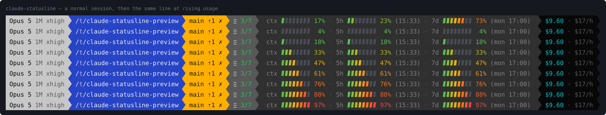
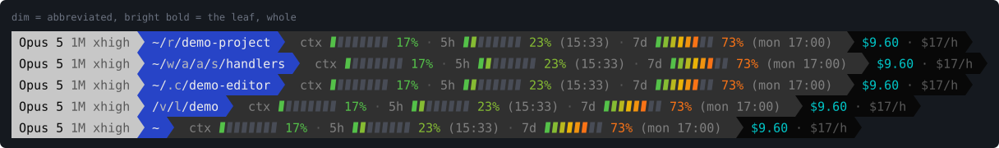
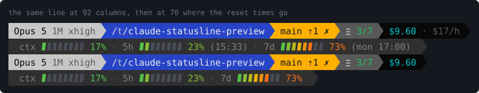

# claude-statusline

[](https://github.com/driin0/claude-statusline/actions/workflows/tests.yml)

A Claude Code status line that matches a Powerlevel10k prompt: the same
powerline blocks, the same palette, plus gradient gauges for context usage,
the 5-hour and 7-day rate limits, and the session cost.



The image is generated from the script itself (`sh tools/make-preview.sh`),
using the ANSI palette of the iTerm2 profile it was designed against, so it
cannot drift from what the code actually renders. Locally, `./preview.sh`
prints the line in the terminal and `./preview.sh --sweep` reproduces the
gradient sweep above.

## Segments

| Segment | Source field | Notes |
|---|---|---|
| Model | `model.display_name` | `Opus 5 (1M context)` → `Opus 5 1M`; falls back to `Claude` |
| | `effort.level` | dim badge next to the model — nothing else says which is active |
| | `fast_mode` | `⚡`, only while it is on |
| Directory | `cwd` | `$HOME` → `~`, parents cut to one character |
| Git | `git` in `cwd` | branch, `⇡`ahead `⇣`behind, `✓` clean / `✗` dirty; omitted outside a repo |
| Task | `session_id` → `tasks/` | `≣ 3/7`, completed over total; omitted when no list is open |
| `ctx` | `context_window.used_percentage` | context window filled |
| `5h` | `rate_limits.five_hour` | usage + **time left** to the reset |
| `7d` | `rate_limits.seven_day` | usage + reset weekday and clock time |
| Cost | `cost.total_cost_usd` | session spend, truncated to cents |
| | `cost.total_api_duration_ms` | burn rate, `$17/h` |

The burn rate divides by **API** time, not by `total_duration_ms`. Wall-clock
includes every minute the session sat idle, so a session left open over lunch
would report a rate well below what the work actually costs — and a number
wrong in the reassuring direction is worse than no number. Under a minute of
API time the ratio is noise, so nothing is shown.

Every segment is independently optional: a field the payload does not carry
simply drops out of the line instead of rendering a zero or a placeholder.

Both rate-limit windows say **when** they reset (`19:05`, `wed 19:05`), never
how long is left. A countdown is only true at the instant it is drawn, and
this line is not drawn on a clock: Claude Code re-runs it when the session
does something, so between events a `2h 33m` would sit there going quietly
stale while still reading as a fact. An absolute time is just as correct an
hour later. The 5h window always lands today or just past
midnight and needs no weekday; the 7d one can be days out and keeps its own.

### Width, and how the shortening is signalled

The line competes with the prompt for one terminal row, so the text carries
no decoration it can afford to lose. The model keeps its window size but
loses the word "context" — which is redundant two segments away from a gauge
labelled `ctx`. The directory follows p10k's `truncate_to_first_char`: every
parent is cut to one character and only the leaf, the part actually being
read, is kept whole (`~/repos/claude-statusline` → `~/r/claude-statusline`).
A leading dot survives the cut, so `.config` reads `.c` rather than a bare
`c`. Paths of two segments or fewer are left alone. Together that is about
11 columns back on a typical line.

Shortening that the reader cannot detect is a trap, so it is marked — with
**brightness, not with an extra character**, because a marker that costs a
column defeats the point:



| Rendered as | Meaning | fg |
|---|---|---|
| dim | abbreviated — this is not the component's real name | 250 |
| normal | left whole (a structural `/` or `~`, or a name already one character) | 254 |
| **bright bold** | the leaf: never shortened | 255 |

The same rule runs across the whole line: the model's `1M` badge, the gauge
labels and the reset times are all dim because they are secondary, and the
one bright thing in each gauge is the number.

The three foregrounds are `DIR_FOREGROUND`, `DIR_SHORTENED_FOREGROUND` and
`DIR_ANCHOR_FOREGROUND` + `DIR_ANCHOR_BOLD`, read straight out of
`~/.p10k.zsh` — so a path renders identically in the prompt and in the status
line one row away. The colour is picked by comparing the shortened component
against the original rather than by assuming the cut removed something, so
`/a/b/c` stays at normal brightness: nothing was lost there.

One deliberate difference from p10k: its `SHORTEN_STRATEGY` is
`truncate_to_unique`, which shortens each parent to the shortest prefix no
sibling directory shares. That is prettier and needs a directory listing per
parent on every render; this uses the first character unconditionally.

### The task count

`≣ 3/7` is the session's task list: completed over total. It is the one segment
that does not come from the payload, because the payload does not carry it. Claude Code keeps the list on disk instead, one JSON file per task
under `<config dir>/tasks/<list id>/`, and the segment counts them.

The list id is the session id, unless `CLAUDE_CODE_TASK_LIST_ID` overrides it,
which is what a shared team list does. Every character outside `[a-zA-Z0-9_-]`
is mapped to `-` first, because that is what Claude Code does before using the
value as a directory name — and matching it is what makes the lookup find the
real directory. It also means a session id can never walk out of the tasks
tree: `/` and `.` are gone before the value is part of a path.

**The segment disappears on its own.** Claude Code deletes every task file the
moment the last one completes, so an empty directory is the resting state and
renders nothing rather than `0/0`. The `.highwatermark` left behind counts
tasks that once existed, which is not a reading anybody wants on a status line.
Nothing needs to know when a list ends.

**The count is green only while a task is in progress.** A list that is open
with nothing moving is drawn plain, and that is the reason the colour is there
at all: it means the work stopped. Green is `#22c55e`, the gradient's first
stop, which appears nowhere else on the line — the gauge cells start one step
in, at `#54c149`.

**The icon is `≣` (`U+2263`), and deliberately not a tick.** The git segment
already spends `✓` on "clean"; two different ticks on one line, meaning two
different things, is worse than no icon at all.

Three codepoints were rejected before it, and the sequence is worth recording
because every one of them failed the same way: by reasoning about a property
that can be measured locally instead of the one that decides — **whether the
glyph is in the font that will actually draw it, on the machine that will draw
it**.

| tried | why it looked right | why it was wrong |
|---|---|---|
| `☰` `U+2630` | `East_Asian_Width=W`, so the width is deterministic | `W` says how many cells the terminal *reserves*, not how wide the *drawn* glyph is. Missing from the terminal font it comes from fallback with its own advance: measured on stock Windows Terminal at ~1.5 of the 2 cells reserved. Also absent from MesloLGS NF |
| `` `U+F0C9` | private use, so one cell, in the same font as the separator | `U+F020`–`U+F0FF` is where Windows maps Wingdings, Webdings and Symbol. Without a Nerd Font it degrades not to an empty box but to an unrelated dingbat — wrong, plausible, never reported as a bug |
| `` `U+F44E` | above `U+F0FF`, so nothing legacy claims it: fails *visibly* | Visibly is still failing, and worse placed than assumed. Stock Windows draws `U+E0B0` from Segoe UI Symbol, so the separators render and only the icon would have been an empty box, in an otherwise perfect line |

`U+2263` needs no fallback at all. It ships **inside the fonts that are already
active** — Cascadia Mono on a stock Windows Terminal, MesloLGS NF and Menlo on
macOS — which is a stronger guarantee than the separator's, since that one does
depend on a fallback happening to be installed.

**No fork.** The files are read and counted in the shell, with no `awk` and no
subshell. An `awk` pass measured +2 ms per render on macOS, and this is the one
segment that could add a fork to *every* render while you work — on Windows,
where a fork is the most expensive thing this script can do, that is not a
trade worth making. Counted in bash it costs nothing measurable at 7 tasks and
about 2 ms at 30. Spaces, tabs and carriage returns are stripped before
matching, so one pattern covers the compact form Claude Code writes, a
pretty-printed file, and CRLF.

### The gauges

Each gauge reads `label bar number (extra)`, and the three are separated by a
dim middle dot:

```
ctx ▰▱▱▱▱▱▱▱ 17% · 5h ▰▰▱▱▱▱▱▱ 23% (19:05) · 7d ▰▰▰▰▰▰▱▱ 73% (wed 19:05)
```

- **The label leads.** It names the thing before the eye reaches its value,
  and it keeps the two variable-width pieces — the number and the
  parenthetical — together at the end instead of straddling the bar.
- **The number is painted the colour of its own bar's tip.** The gauge is a
  position-based gradient, so the last filled cell already encodes severity;
  giving the number that same colour means the value can be read at a glance
  without counting cells. Green number, plenty of room. Red number, not.
- **Its width is pinned at three digits** (`%3d`), so a value crossing 9→10
  no longer shoves everything to its right sideways. That boundary is crossed
  early and often by all three gauges; the shift is small but constant, and
  the eye tracks it.
- **There is no literal space before it.** `%3d`'s own padding is the gap, so
  the bar and its number read as one object. Three digits are the single
  exception and get a space of their own: at 100% the last cell and the
  number are both red, and with nothing between them they merge exactly when
  the reading matters most. That costs one column of shift when a gauge
  saturates — cheap, since 99→100 is crossed at most once and the value
  cannot change afterwards. A test pins both halves of this.
- **The separator is U+00B7 at grey 240**, one shade below the labels: enough
  to group the three readings, not enough to join the competition for
  attention. It only appears *between* gauges, so a payload carrying one
  window renders no dangling dot.
- **The label and the parenthetical are dim** (grey 244), so the only things
  competing for attention are the bar and its number.

## Narrow terminals

The full line is about 145 columns. A Claude Code pane is often far less than
that, so when the line will not fit it splits in two:



Claude Code captures the script's output instead of attaching it to a
terminal, so `tput` and `/dev/tty` are both unavailable — `/dev/tty` reports
"Device not configured". It exports `COLUMNS` and `LINES` instead, and that is
what the layout reads. **With `COLUMNS` unset the layout always stays on one
row**, which is what keeps the preview images and the test suite
deterministic.

The seam is where the meaning changes: the first row answers *where am I*
(model, directory, git, cost), the second *how much is left* (the gauges). The
gauge row is also the one whose width actually grows.

If a row still overruns, pieces are dropped in a fixed order rather than
wrapping further:

| Width | What goes |
|---|---|
| ~145+ | nothing — one row |
| below that | split into two rows |
| gauge row still too wide | the reset times `(19:05)` `(wed 19:05)` — inferable, and ~20 columns |
| identity row still too wide | the burn rate — the only piece on that row that is an inference rather than a fact |

Below about 58 columns the gauge row cannot give any more ground: what is left
is the bars themselves.

**The decision is made against the width the line *could* reach, not the width
it happens to have.** Each percentage gains a column at 100%. Without that
allowance the layout would flip between one and two rows as the numbers
changed — a whole row appearing and disappearing, far worse than the
one-column jitter `%3d` exists to prevent. With it, the row count changes only
when the window is resized.

Showing *when* instead of *how long* pays a quiet second dividend here. A
countdown changes width as the window drains — `(4h 59m)` is three columns
wider than `(45m)` — so the slack would have to cover that too. `(HH:MM)` is
seven columns whatever the clock says, which also means a nonsense timestamp
cannot stretch the line and does not have to be suppressed to keep it in
width.

## Colours

Segment backgrounds are 256-colour codes copied from `~/.p10k.zsh`, so the
line follows the terminal theme exactly like the shell prompt does:

| Segment | fg / bg | p10k equivalent |
|---|---|---|
| model | 232 / 7 | `os_icon` |
| directory | 254 / 4 | `dir` |
| git clean | 0 / 34 | `vcs` clean, departed |
| git dirty | 0 / 214 | `vcs` modified, departed |
| metrics | 250 / 236 | dark panel |
| cost | 6 / 232 | `background_jobs`, departed |

### Where it departs from p10k, and the rule behind it

Three segments do not copy p10k, and they are exactly the three whose colour
carries **information** rather than decoration. Colours 0–15 are the
terminal's to redefine, so a value in that range is a request, not a choice;
16–255 are fixed. Hence the rule: **if the meaning of a colour is a contrast —
with the background, or with another segment — it may not live in 0–15.**
Identity colours stay in the theme on purpose. The model's bg `7` and the
directory's bg `4` are supposed to match the shell prompt; looking at home is
the whole point of them.

**Cost** was p10k's bg `0`. The p10k presets map ANSI black onto the iTerm2
background, so the segment rendered as nothing at all — and looked deliberate
doing it, while on Windows, where black is `#000`, it was a solid block. 232
is the darkest step of the greyscale ramp (`#080808`).

**Git** was p10k's bg `2` (clean) and bg `3` (dirty). Measured in the profile
where this went wrong, ANSI 2 is `(0,194,0)` and ANSI 3 is `(199,196,0)`: 61
degrees of hue apart, and dirty reads as a yellow-*green* rather than as
yellow. The one distinction on that segment anybody needs had gone soft.

A fixed *yellow* does not fix it. Yellow and green differ only in the red
channel — yellow is R=G with B=0, green is G alone — so with green high in
both, the eye keeps reading both as green. That is the failure itself, not a
side effect of the theme.

The operative condition is **R > G**: an orange. No yellow and no yellow-green
can satisfy it, because both keep R ≤ G. 106 (`#87af00`) and 178 (`#d7af00`)
were tried first and are a good illustration of the trap — both sit at G=175
with B=0 and differ *only* in red, which is the very axis that is already
weak, so they land 25 degrees apart instead of 61. 214 (`#ffaf00`) is R=255
against G=175, and against 34 (`#00af00`) the gap is 79 degrees. Orange is
also what "dirty" means.

The gauge cells are the exception: they use 24-bit truecolour for a
**position-based** 4-stop gradient (green `#22c55e` → yellow `#eab308` →
orange `#f97316` → red `#ef4444`). Position-based, not value-based, means
cell 7 is orange whether the gauge reads 90% or 100% — the colour marks
*where you are on the bar*, so a nearly-full gauge is red at its tip no
matter the exact number.

## Performance

The line is redrawn constantly, so the ~16 ms it takes is worth the trouble it
took to get there. Both columns are measured on the same machine: the left is
the obvious way to write each part, which is what this started as.

| | the obvious way | here |
|---|---|---|
| JSON parsing | 28 ms — a dozen `sed`/`grep` pipelines, ~30 forks | **2.9 ms** — one `awk` pass |
| git | 23 ms — `rev-parse` + `branch` + `status` | **8.5 ms** cold, ~0 cached — one `status --porcelain=v2 --branch` |
| **total** | **48 ms** | **16 ms** |

### Windows pays for forks, and pays a lot

Those figures are from macOS. On Windows the same script took **202 ms** per
render, because MSYS has no real `fork()` and emulates it by recreating the
process. Measured here, 50 iterations each:

| | cost per call |
|---|---|
| a builtin (`printf -v`) | 0.8 ms |
| a subshell, nothing exec'd (`x=$(shell_function)`) | **7.8 ms** |
| an external process (`x=$(date)`) | **14.5 ms** |

On Unix both of the latter are under a millisecond, so the ordinary spelling
`x=$(helper ...)` looks free and is not. The helpers now return through named
globals — `RP_OUT`, `FC_OUT`, `BAR_OUT`, `ROW_W` and so on, the pattern
`grad_color` already used for `GC_R`/`GC_G`/`GC_B` — and the one `| tr` became
seven `case` branches. That removed about a dozen forks per render and took
Windows from **202 ms to 112 ms**, with byte-identical output. What is left is
mostly unavoidable: starting `bash` at all is 19 ms of it.

Two things fell out of that rather than being added for their own sake.
Ahead/behind comes from the `--branch` header, so it costs nothing once the
call is being made anyway — on its own it would never have justified a fourth
git process.
And the 2-second cache in front of git matters less for the 8 ms than for the
pathological case: on a large repository `status` walks the whole worktree and
the status line stalls with it, while the line is redrawn far more often than
the worktree changes. Being stale is bounded and self-correcting — for at most
two seconds after a commit the segment shows the previous state.

## Requirements

- **A Nerd Font** — or `CLAUDE_STATUSLINE_PLAIN=1` instead. The separator is
  `U+E0B0`, the same codepoint as `POWERLEVEL9K_LEFT_SEGMENT_SEPARATOR`, and
  it is the only glyph on the line that needs a patched font. Everything else
  is plain Unicode, present in Cascadia Mono, Menlo and MesloLGS NF alike: the
  gauge cells (`▰` `▱`), the git check, the ahead/behind arrows and the task
  icon (`≣`). The one exception is the fast-mode bolt `⚡` (`U+26A1`), which is
  emoji-presentation and two columns wide — the layout budgets for that, but a
  console with no emoji font at all draws it as tofu and the model segment ends
  up a column short. Setting `CLAUDE_STATUSLINE_PLAIN=1` swaps the arrow for
  `U+258C`, the left half block, which is also stock: drawn with the same
  foreground/background pair it renders the segment boundary as a straight
  edge rather than a point, and it is one column wide like the arrow, so no
  layout arithmetic changes. Because the requirement covers the separator
  alone, that single substitution leaves the line legible on a stock font, the
  bolt above being the one thing that still wants an emoji one. Wire it into
  `settings.json` as
  `"command": "CLAUDE_STATUSLINE_PLAIN=1 bash \"$HOME/.claude/statusline-command.sh\""`
  — or, with `CLAUDE_CONFIG_DIR` set, that directory instead of `~/.claude`,
  which is where `install.sh` puts the symlink and what it writes into
  `settings.json`. Re-running the installer keeps a command it can see already
  runs this script, prefix included.

  Whether the hatch is needed at all is per-platform, and both halves below
  were measured rather than assumed:

  * **Windows — not needed.** `U+E0B0` is absent from Cascadia Mono, the
    Windows Terminal default, but Segoe UI Symbol ships with the OS and
    carries it, so the arrows render on a stock machine with no Nerd Font in
    sight. Confirmed by eye, and discovered the hard way: switching that
    machine to the plain separator was noticed immediately as a regression.
  * **macOS — needed.** No default terminal font covers it: SF Mono, Menlo,
    Monaco, Andale Mono, Courier New and Apple Symbols all lack it. The system
    fonts that do claim the codepoint are Apple's Arabic PUA faces, which map
    presentation forms into that area rather than arrows, plus `.LastResort`.
    The fallback is therefore a placeholder box or an Arabic ligature —
    neither of which is a separator.
  * **Linux — assume needed.** It depends entirely on what the distribution
    installs, and a minimal one installs nothing that covers the PUA.

  The private use area is still worth understanding before putting another
  glyph on this line, because that fallback is luck rather than design. On
  Windows the PUA is not free: Wingdings, Wingdings 2, Wingdings 3 and
  Webdings occupy `U+F020`–`U+F0FF`. A codepoint in that range does not
  degrade to an honest tofu box — it degrades to an unrelated dingbat, at
  whatever width that font happens to use, and the result looks deliberate
  enough that nobody reports it as a missing font. `U+E0B0` sits below the
  range and got lucky; anything added later should sit above `U+F0FF`.
- **A truecolour terminal** for the gradient. Without it the gauges still
  render, just flat.
- `bash`, `awk`, `git`, `date` — all stock. No `jq` at runtime (only
  `install.sh` uses it), no other dependency.
- **git ≥ 2.11** for `--porcelain=v2`. Older git produces no output, so the
  segment disappears rather than showing a wrong state.

Written for **macOS bash 3.2**: no `printf "%.0f"`, no associative arrays,
integer arithmetic throughout. It runs on newer bash unchanged, and on Linux
too — `date` is tried BSD-first (`-r`), then GNU (`-d @`).

### Windows

Claude Code runs the status line through **Git Bash** when it is installed,
and through PowerShell when it is not — so this script needs Git Bash. There
is no PowerShell port.

Two things are handled here:

- **Line endings.** Git for Windows defaults to `core.autocrlf=true`, which
  would check the scripts out with CRLF. That does not merely warn: every line
  ends in a stray `\r`, `read -r model` becomes an invalid identifier, and the
  script collapses. `.gitattributes` forces LF.
- **Paths.** The payload carries a native path (`C:\Users\me\repos\thing`).
  The shortening splits on `/`, so it is normalised first, guarded by a
  leading drive letter — which a POSIX path cannot have, so a Unix path
  containing a backslash is untouched. The separator is then *remembered*
  rather than discarded and the components are joined back up with `\`:
  splitting on `/` is an implementation detail, and a Windows path rendered
  with forward slashes reads as somebody else's machine.
- **The home directory.** `$HOME` inside Git Bash is the mount form
  (`/c/Users/me`) while the payload is native (`C:\Users\me`), so the two
  never match and the home would never collapse. `USERPROFILE` is that same
  home written the way the payload writes it, so that is what the comparison
  uses: `C:\Users\me\repos\thing` renders as `~\r\thing`. With no
  `USERPROFILE` the drive stays put and it renders as `C:\U\m\r\thing` —
  the honest fallback, since guessing at a home directory is worse than
  showing the real path.

Two more facts about the install, both handled by `install.sh`:

- It symlinks the script into `~/.claude`. Git Bash **copies** instead of
  linking unless developer mode is on, so `git pull` does not update the
  installed copy — rerun `install.sh` after pulling. It says which of the two
  it did, and a re-run that changes nothing is a no-op rather than another
  `.bak` file.
- Git Bash ships neither `jq` nor Python, and `python3` on a stock Windows is
  the Microsoft Store execution alias: it is on `PATH`, `command -v` finds
  it, and it exits non-zero after advertising the Store. So interpreters are
  probed by *running* them, and the fallback order is jq → python → node —
  node being the one a machine running Claude Code tends to already have.

Run `sh install.sh` **from Git Bash**, not from cmd or PowerShell.

## Install

```sh
git clone <this repo> ~/repos/claude-statusline
cd ~/repos/claude-statusline
sh install.sh
```

`install.sh` symlinks `statusline.sh` into `~/.claude/statusline-command.sh`
and sets the `statusLine` key in `~/.claude/settings.json`, backing up
anything it replaces and leaving every other key alone. Because it is a
symlink, `git pull` is the whole update procedure. It honours
`CLAUDE_CONFIG_DIR` if set.

It edits the settings with `jq`, or `python3` if `jq` is absent — Git Bash on
Windows ships neither, and hand-editing JSON is the kind of one-time step that
goes wrong quietly. With neither available it prints the exact snippet to paste
and changes nothing.

Then verify:

```sh
./tests/run-tests.sh     # must print "N passed, 0 failed"
./tests/install-tests.sh # the installer itself, in a sandboxed HOME
./preview.sh             # the line, without a live session
```

The new line appears on Claude Code's next render; no restart. If it renders as
mojibake instead of connected blocks, the terminal lacks a Nerd Font — a
terminal setting, not something the installer can fix. If installing one is not
an option, `CLAUDE_STATUSLINE_PLAIN=1` renders the same line with a stock-font
separator instead; see Requirements.

## Layout

```
statusline.sh              the whole status line, no dependencies
install.sh                 symlink + settings.json wiring (POSIX sh)
preview.sh                 render without a live session; --sweep for the gradient
tests/run-tests.sh         127 assertions on the rendered line
tests/install-tests.sh     24 assertions on install.sh, in a fake HOME
tests/payload-example.json a real payload, scrubbed
tools/make-preview.sh      regenerate the three images under docs/
tools/ansi-to-svg.py       ANSI -> SVG, used by the above
tools/read-iterm-palette.sh  re-read the iTerm2 colours after a theme change
.github/workflows/tests.yml  macOS + Linux + shellcheck + preview drift
CLAUDE.md                  install and contribution notes, for an agent
```

## Tests

```sh
./tests/run-tests.sh
```

127 assertions over the real payload plus the shapes that break things:
missing and `null` reset timestamps, a reset already in the past, `{}`, empty
input, a pretty-printed payload, decimal percentages, an escaped quote in a
value, a command hidden in a path, cost as an integer, a home directory
and a path below it, a width check that fails if the percentage field starts
jittering again, a real temporary repository driven through clean / untracked
/ ahead / behind / detached, and the layout at four terminal widths — asserting
not just the row count but that every row actually fits in the columns it was
given.
Most map to a bug that shipped at least once — see the header of the file.

CI runs the suite on **macOS and Linux**. macOS is not one more platform here,
it is *the* platform: `/bin/bash` there is 3.2.57, and a regression like
`printf "%.0f"` — which once silently zeroed every gauge — runs fine on a
Linux runner and fails only on the machine that matters. Linux catches the
mirror image: a BSD-only flag that happened to work locally. A fourth job
regenerates the preview images and fails if they differ from what is
committed, because stale images are invisible in review.

`tests/payload-example.json` is a real status-line payload (Claude Code
2.1.263) with the paths and identifiers scrubbed. It is the reference for
what the schema actually looks like; the parsing in `statusline.sh` is
written against it, not against guesses.

## Parsing notes

No `jq` at runtime means the JSON is read by hand — one `awk` pass emitting
the values newline-separated in a fixed order, read back with `read`.

**Never `eval`.** The payload is untrusted text and `cwd` is a real filesystem
path: a directory whose name contains a quote would end an `eval`'s quoting
and run whatever came after it. `read` treats it as data. A test puts a
command inside a path and asserts it did not run.

Two shapes need different handling, and getting either wrong fails silently
rather than loudly:

- **Repeated keys.** `used_percentage` lives in `context_window` *and* in
  every `rate_limits.*` object. Each is read only after its parent object has
  been sliced out, so a match cannot cross into a sibling. (The original bug:
  a greedy `.*` matched the **last** occurrence and all three gauges showed
  the same number, taken from an unrelated object.)
- **Nested objects inside the slice.** `context_window` contains
  `current_usage`, whose closing brace would end the slice before the key is
  reached — it is stripped first.

Both are covered by tests, as is a value containing an escaped quote.

## Payload fields not currently used

Available in the payload, in case the line grows: `effort.level`,
`prompt_cache.hit_ratio`, `fast_mode`, `output_style.name`,
`context_window.remaining_percentage`, `exceeds_200k_tokens`,
`cost.total_duration_ms`, `cost.total_lines_added` / `removed`.

## Licence

MIT — see [LICENSE](LICENSE).
